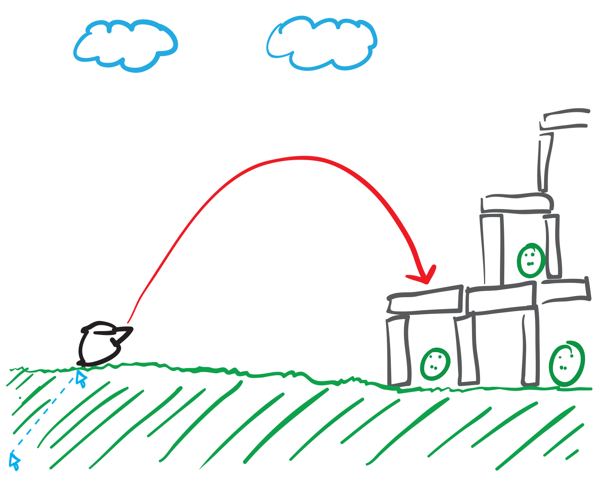

# Furious Fowls

Furious Fowls is a web game inspired by Angry Birds, built with [TypeScript], [p5.js], and [box2d.js].

I originally wrote Furious Fowls in my grade 10 computer science class (ICS2O) class using [Processing] and [fisica]. This repository is my rewrite of the game ten years later for the web.

## Usage

To play the game, visit https://mk12.github.io/furious-fowls.

To hack on the game, run `npm install`, and then:

- `npm run dev` to serve the app with auto-rebuild.
- `npm run build` to build an optimized app bundle.
- `npm run tc` to typecheck the code.
- `npm run lint` to lint the code.
- `npm run fmt` to format the code.

## Gameplay

Win this innovative game by catapulting red birds into green pigs, making them go _Poof!_

Beat all 8 levels in one shot each to unlock a secret capability!

Design your own levels in the level editor!

* * *

* * *

## License

© 2021 Mitchell Kember

Furious Fowls is available under the MIT License; see [LICENSE](LICENSE.md) for details.

[TypeScript]: https://www.typescriptlang.org/
[p5.js]: https://p5js.org/
[box2d.js]: https://github.com/kripken/box2d.js/
[Processing]: https://processing.org/
[Box2D]: https://box2d.org/
[fisica]: http://www.ricardmarxer.com/fisica/
